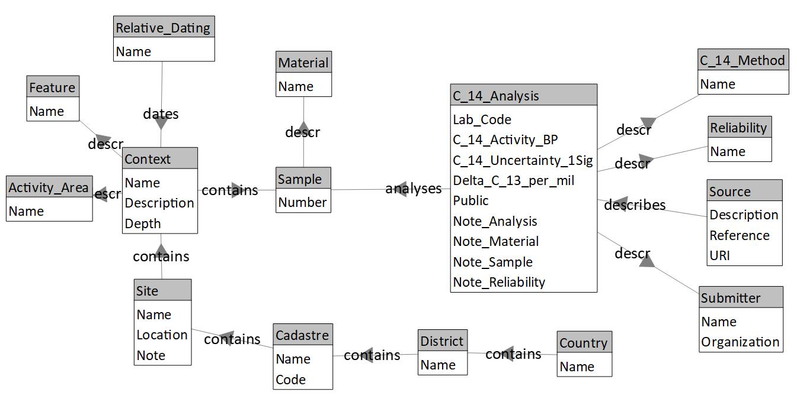
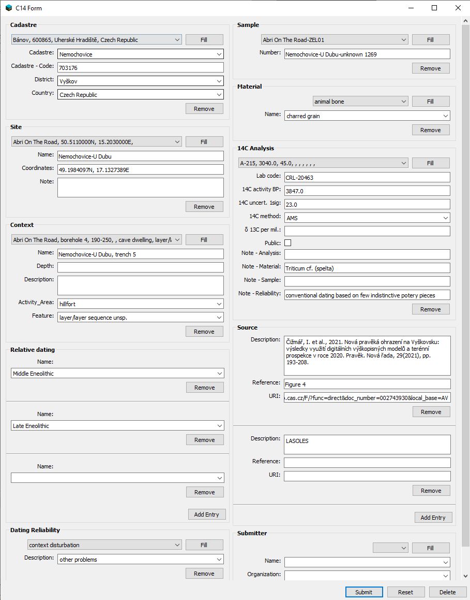
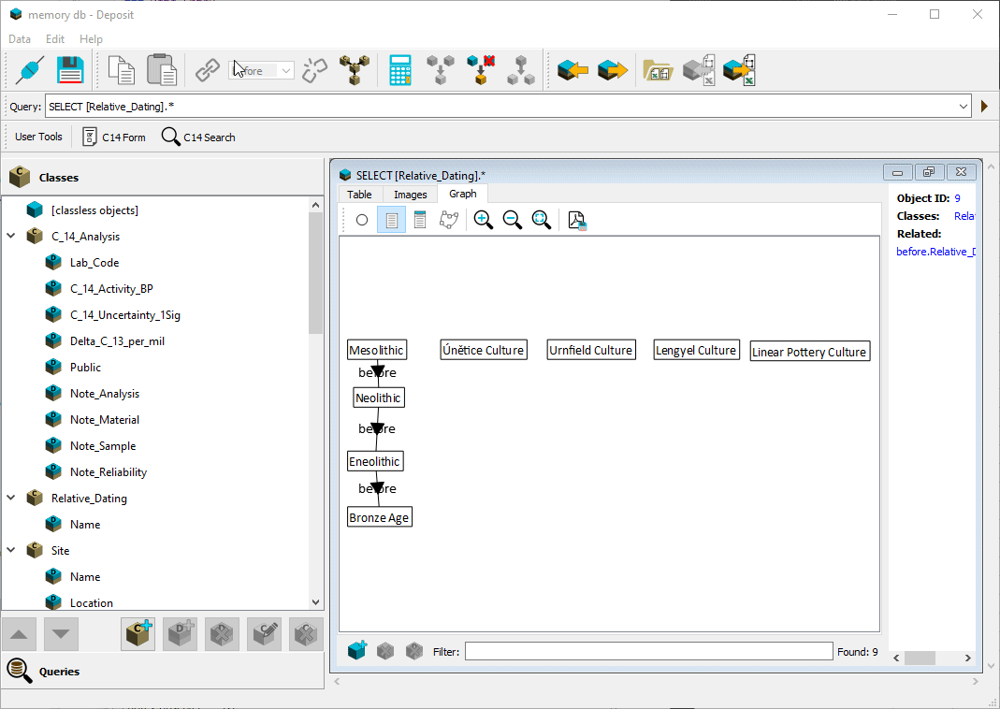

# Arch14CZ - Backend
Backend interface for Arch14CZ - Czech Archaeological Radiocarbon Database

Created on 14. 12. 2021

**Table of Contents**
1. [About Arch14CZ](#about)
   1. [Database Schema](#schema)
2. [Installation](#installation)
3. [Usage](#usage)
   1. [Connecting to a Backend Database](#connecting)
   2. [Data Entry](#data_entry)
   3. [Ordering Relative Datings](#ordering)
   4. [Importing Excel Data](#import)
   5. [Choosing a Radiocarbon Calibration Curve](#curve)
   6. [Publishing Data](#publishing)
   7. [Restoring from Backup](#restoring)
4. [Developer Notes](#developer)
   1. [Preparing the Virtual Environment](#venv)
   2. [Cloning the GitHub Project](#cloning)
   3. [Building a Windows Executable](#building)
5. [Contact](#contact)
6. [Acknowledgements](#acknowledgements)
7. [License](#license)

## About Arch14CZ - Backend 
Backend graphical user interface for Arch14CZ - Czech Archaeological Radiocarbon Database.

For the frontend interface see the [arch14cz_frontend](https://github.com/demjanp/arch14cz_frontend) project.

### Database Schema 
The database is be based on the [Deposit](https://github.com/demjanp/deposit) graph model, comprised of Classes representing different types of data, Descriptors representing attributes of the particular records, Objects representing those unique records (data points) and Relations representing connections between these records.

*Database schema: Classes (on grey background), their Descriptors (in frames) and Relations between them.*

## Installation 

For a Windows installer see:

[https://github.com/demjanp/arch14cz_backend/releases/latest](https://github.com/demjanp/arch14cz_backend/releases/latest)

## Usage 
The Arch14CZ backend interface is used to connect to the backend database, enter new data or import it from an Excel file, order relative datings and publish the data to the frontend database.

>Note that after adding an entry or entries with a new relative dating, appropriate chronological relations have to be added to it before it can be published to the frontend database.

### Connecting to a Backend Database 
To connect to a backend database, use the command `Backend` &rarr; `Connect` and select a data source. The data source can be either a local file (Pickle and JSON formats) or a PostgreSQL database.

You can create a new Pickle or JSON database by entering its path (e.g. `C:/data/data.pickle`) and clicking `Create`.

You can create a new PostgreSQL database by entering the connection details (a blank database has to be already created on the server, for example using pgAdmin), choosing a new identifier and clicking `Create`.

PostgreSQL Relational is a special format to preserve maximum compatibility of Deposit, which is a graph database, with relational databases. In this format relations are stored using join tables which can cause loading and saving to take longer.

>Note that when using a PostgreSQL backend, you need to specify a local folder. In this folder a backup will be stored each time you save the database if the option `Backend` &rarr; `Backup after every save` is enabled.

### Data Entry 
1. Before entering new data, ensure that the Arch14CZ schema is created in the current database via the command `Backend` &rarr; `Create Schema`.
2. Open the backend database using the command `Backend` &rarr; `Open`.
3. Click on `C14 Form` on the `User Tools` toolbar.
4. Fill in the form (see the [Import](#import) section for details on different fields) and click `Submit`.

*Example of a filled entry form.*

All field groups except `Relative Dating` and `Source` have a drop-down list, with the possibility to look up if an entry is already present in the database and use the `Fill` button to fill it in. 

### Ordering Relative Datings 
For the frontend database to function properly, relative datings have to be ordered. This is done by creating `before` type relations between the relative dating entries, which indicate that one relative dating is earlier (before) another. Based on these relations, the Arch14CZ application can then calculate ordering of the dates which can be used to specify a relative dating range when querying the database.

1. Open the backend database using the command `Backend` &rarr; `Open`.
2. Open the `Relative Dating` Class by double-clicking its name in the left navigator pane. Alternatively, you can click on the `Relative Datings - General` tool on the `User Tools` toolbar to list only general datings, without specified phases.
3. Click the `Graph` tab on the query window.
4. Find an entry that is not yet linked to at least one other entry. All entries should have at least one link an earlier and one link to a later dating (as far as there is one).
5. Find the closest dating which is later than the selected one and create a `before` type relation to it as shown in the animation:
6. In a similar way, create a `before` relation between the closest earlier entry and the selected entry.
7. Repeat until all entries are connected in a chronological sequence.

Detailed relative datings where e.g., a phase of a culture is specified, can also be linked to more general datings by a `contains` relation. For example the dating `Linear Pottery Culture` can contain the dating `Linear Pottery Culture, phase IIa`. A dating which only has a `contains` relation will be ordered in the same way as the dating by which it is contained.

The command `Backend` &rarr; `Update Datings` automatically links all general and detailed datings by a `contains` relation. For example `Linear Pottery Culture, phase IIa` would generate two linked datings `Linear Pottery Culture` &rarr; `contains` &rarr; `Linear Pottery Culture, phase IIa`.

### Importing Excel Data 
Data can be imported from an Excel (.xlsx) file via the menu `Backend` &rarr; `Import Excel Data`. For an example, see [import_sample.xlsx](import_sample.xlsx). 

The file has to contain the following columns:
1. Lab Code
	The laboratory code is unique for each sample and serves to identify it. It also carries information about the laboratory that measured the sample.
2. C-14 Activity BP:
    C-14 measurement in radiocarbon (uncalibrated) years BP
3. C-14 Uncertainty 1 Sigma:
    1-sigma uncertainty of the measurement
4. C-14 Method:
    AMS or conventional
5. Delta C-13:
    Delta C-13 measurement
6. C-14 Analysis Note
7. Country
8. Cadastre
9. Cadastre Code:
    Code of the cadastre (see https://www.czso.cz/csu/rso/katastralni_uzemi_rso).
10. District
11. Site Name
	Unique name of the site where the sample was collected.
12. Site Coordinates:
    WGS 84 standard, format XX.XXXXXXXN, XX.XXXXXXXE
13. Site Note
14. AMCR ID
	Identifier of an archaeological event ('akce') in the [Archaeological Map of the Czech Republic](https://amcr-info.aiscr.cz/)
15. Activity Area:
    Type of the archaeological activity area according to the AMCR dictionary.
    Validated against [activity_area.csv](src/arch14cz_backend/data/activity_area.csv).
16. Feature:
    Type of the archaeological feature according to the AMCR dictionary.
    Validated against [feature.csv](src/arch14cz_backend/data/feature.csv).
17. Context Description
	Description of the position of the sample within the feature.
18. Context Depth cm:
    Depth at which the sample was retrieved.
19. Context Name:
    Identifier of the context within the site (e.g., Feature 123).
20. Relative Dating Name 1:
    Relative dating of the context, as detailed as possible in the format "[General Dating], [phase]" (e.g., Lengyel Culture, phase I).
    The general dating is validated against [relative_dating.csv](src/arch14cz_backend/data/relative_dating.csv).
21. Relative Dating Name 2:
    Additional relative dating.
22. Sample Number:
    ID assigned by the submitter of the dated sample.
23. Sample Note
	Includes collagen values and other accompanying measurements.
24. Material Name
	General type of the material of the sample (e.g., animal bone, charcoal). Validated against [material.csv](src/arch14cz_backend/data/material.csv).
25. Material Note
	Detailed description of the material (e.g. sus scrofa, triticum monococcum)
26. Reliability:
    Reliability of the C-14 dating in respect to the archaeological context. Possible values:
    <pre>no problems declared
    in contradiction with archaeological chronology/sequence
    no archaeological finds associated
    context disturbation
    other problems
    sample contamination
    </pre>
27. Reliability Note
28. Source Description:
    Citation of the source.
29. Source Reference:
    Reference to page or figure.
30. Source URI:
    DOI or aleph link (where applicable).
31. Source Acquisition:
    Original source of the data (Arch14CZ, C14.sk or other database) 
32. Submitter Name
	In the format [First name] [Last Name]
33. Submitter Organization
34. Public:
	1 or 0, indicates whether the date can be published (if set to 0, the values of C-14 activity and uncertainty will be set to -1 when publishing to the frontend database)

### Choosing a Radiocarbon Calibration Curve 
The software is supplied with the IntCal20 calibration curve by Reimer et al. [^1].

You can download the latest calibration curves from the [IntCal](http://intcal.org/curves.html) website.

To load the calibration curve:
1. In the Arch14CZ program, open the menu `Settings` and click on `Calibration Curve`.
2. Select the file containing the calibration curve data.

[^1]: <small>Reimer, P., Austin, W., Bard, E., Bayliss, A., Blackwell, P., Bronk Ramsey, C., Butzin, M., Cheng, H., Edwards, R., Friedrich, M., Grootes, P., Guilderson, T., Hajdas, I., Heaton, T., Hogg, A., Hughen, K., Kromer, B., Manning, S., Muscheler, R., Palmer, J., Pearson, C., van der Plicht, J., Reimer, R., Richards, D., Scott, E., Southon, J., Turney, C., Wacker, L., Adolphi, F., Büntgen, U., Capano, M., Fahrni, S., Fogtmann-Schulz, A., Friedrich, R., Köhler, P., Kudsk, S., Miyake, F., Olsen, J., Reinig, F., Sakamoto, M., Sookdeo, A. and Talamo, S. (2020) The IntCal20 Northern Hemisphere radiocarbon age calibration curve (0–55 cal kBP). Radiocarbon, 62(4), pp.725-757. doi:10.1017/RDC.2020.41</small>

### Publishing Data 
To publish data to the frontend database, follow these steps:
1. Connect to the frontend database using the command `Frontend` &rarr; `Connect`.
2. Enter the connection details (a PosgreSQL database must already exist on the server).
3. Publish the database using the command `Frontend` &rarr; `Publish`. 

This will automatically calculate the order of relative datings and 95% ranges of calibrated dates for each C-14 date. The data will be then uploaded to the frontend database.

### Restoring from Backup 
If the option `Backend` &rarr; `Backup after every save` is enabled, a backup copy of the database is stored before each save. You can return to a previous version of the database simply by loading one of the backups in the Arch14CZ - backend application.

Backups can be found in the subdirectory `_backup` of the local folder, which can be accessed by clicking the link next to `Local Folder` on the main interface.

To save a database restored from a file format in PostgreSQL format, open the Deposit inteface via the menu `Backend` &rarr; `Open` and save it via the menu `Data` &rarr; `Save As PostgreSQL`.

## Developer Notes 
### Preparing the Virtual Environment 

Arch14CZ - Backend requires Python 3 and a Windows environment. To prepare a Python virtual environment for development:

1. Open a terminal or command prompt window.
2. Navigate to the Arch14CZ - Backend root directory: 
<pre><code>cd [path to local Arch14CZ - Backend dir]</code></pre>
3. Create the virtual environment:
<pre><code>python -m venv [VE dir name e.g. 'venv']</code></pre>
4. Activate the virtual environment:
<pre><code>venv\Scripts\activate.bat</code></pre>
5. To exit the virtual environment:
<pre><code>deactivate</code></pre>

### Cloning the GitHub Project 

To clone the `arch14cz_backend` GitHub project, follow these steps:

1. Make sure you have [Git](https://git-scm.com/downloads) installed on your computer.
2. Open a terminal or command prompt window.
3. Navigate to the Arch14CZ - Backend root directory.
4. Run the following command:
<pre><code>git clone https://github.com/demjanp/arch14cz_backend.git</code></pre>
5. The repository will be cloned to a new directory named `arch14cz_backend` in your current directory.
6. Change into the newly created directory:
<pre><code>cd arch14cz_backend</code></pre>
7. To install dependencies run the following command:
<pre><code>pip install -e .</code></pre>
8. To start the GUI run the following commands:
<pre><code>cd bin
python start_arch14cz.py</code></pre>

### Building a Windows Executable 
1. Make sure you have [InstallForge](https://installforge.net/download/) installed on your computer.
2. Update absolute paths in `installer\arch14cz_installer.tpl` in the following sections:
<pre><code>[Graphics]
	Wizard image
	Header image
[Build]
	File
	SetupIconPath
	UninstallIconPath</code></pre>
3. Update virtual environment path in `installer\arch14cz.spec` in the part `pathex=['..\\venv\\Lib\\site-packages'],`.
5. Activate the virtual environment.
6. Execute the following commands once per virtual environment:
<pre><code>python -m pip install --upgrade build
pip install pyinstaller</code></pre>
6. Deactivate the virtual environment.
7. Run `build.bat`.
8. Run InstallForge and open the file `installer\arch14cz_installer.ifp`.
9. Use the Build command in InstallForge to build the installer.

## Contact: 
Peter Demján (peter.demjan@gmail.com)

Institute of Archaeology of the Czech Academy of Sciences, Prague, v.v.i.

## Acknowledgements 

Development of this software was supported by OP RDE, MEYS, under the project "Ultra-trace isotope research in social and environmental studies using accelerator mass spectrometry", Reg. No. CZ.02.1.01/0.0/0.0/16_019/0000728.

This software uses the following open source packages:
* [Deposit](https://github.com/demjanp/deposit)
* [Deposit GUI](https://github.com/demjanp/deposit_gui)
* [NetworkX](https://networkx.org/)
* [NumPy](https://www.numpy.org/)
* [openpyxl](https://openpyxl.readthedocs.io/)
* [Psycopg](https://psycopg.org/)
* [PySide2](https://www.pyside.org/)
* [Qt](https://www.qt.io)
* [SciPy](https://scipy.org/)

## License 

This code is licensed under the [GNU GENERAL PUBLIC LICENSE](https://www.gnu.org/licenses/gpl-3.0.en.html) - see the [LICENSE](LICENSE) file for details
